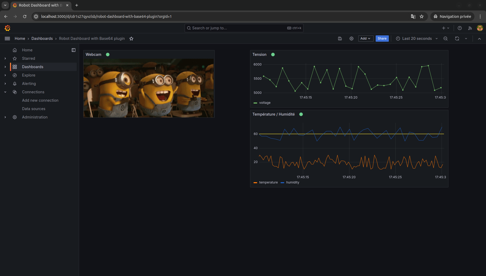

This is a POC to test the ability to display real-time data on a Grafana dashboard via MQTT protocol, such as metrics or a stream of images from a webcam.

The project is composed of the following dockerized modules:
- a Mosquitto MQTT broker
- a Java Spring Boot application sending metric data and images on different MQTT topics to this broker
- the Grafana application containing a datasource to the MQTT broker and a dashboard displaying the different data received from the broker

It uses the [Business Media plugin from Volkov Labs](https://volkovlabs.io/plugins/volkovlabs-image-panel/).




# Installation
Clone the repository :
```shell
git clone https://github.com/peltiern/test-mqtt-grafana.git
```
# Deployment
Go to the project folder :
```shell
cd test-mqtt-grafana/
```
Deploy applications with docker-compose :
```shell
docker-compose up -d
```
# Dashboard display
Open a browser to the following url : http://localhost:3000/

Log in with credentials : admin/admin

Go to the _Dashboards_ menu, then click on the _Robot Dashboard with Base64 plugin_ dashboard to display it.


### **Have fun ! ;-)**